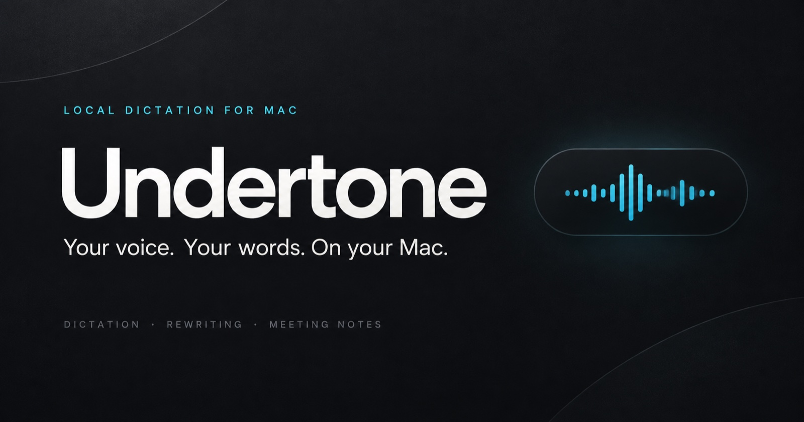

<p align="center">
  
</p>

Undertone is local dictation and meeting notes for macOS. Hold fn, speak, release. Whisper transcribes the recording, a local Ollama model cleans it up, and the text types itself into whatever app is focused. Nothing leaves the Mac, and dictation never writes the clipboard.

## Status

This is a daily-use candidate. It is built and tested on one Apple Silicon Mac. Permissions must be granted by hand, there is no installer. Meeting auto-detection and the quick-note panel are new and lightly tested. Expect rough edges.

## Requirements

- Apple Silicon Mac
- macOS 14.4 or later (needed for the system audio tap used in meeting capture)
- Xcode 16 or later, Swift 6
- Python 3.12 with [uv](https://docs.astral.sh/uv/)
- [Ollama](https://ollama.com), with `qwen3.5:latest` pulled (and `gemma4:31b` if you want the high-quality cleanup level)
- mlx-whisper, installed as part of the engine's Python dependencies

## Install

Clone the repo, then set up the engine:

```sh
uv venv
uv pip install -e .
```

Pull the cleanup model into Ollama. The first is required; the second is only for the high-quality cleanup level:

```sh
ollama pull qwen3.5:latest
ollama pull gemma4:31b
```

The speech model needs no step of its own. On the first run the engine downloads `mlx-community/whisper-large-v3-turbo` from Hugging Face (about 1.6 GB) into the Hugging Face cache and reuses it after that. Check that everything is in place:

```sh
.venv/bin/undertone doctor
```

Start the engine in the foreground. It listens on a Unix socket at `~/.undertone/engine.sock` by default:

```sh
.venv/bin/undertone serve
```

Build the menu bar app:

```sh
UNDERTONE_SIGNING_IDENTITY="Apple Development: you@example.com (TEAMID)" \
  app/scripts/build_app.sh --production
```

The build script requires a real signing identity; it will not produce an ad hoc-signed build. Use your own Apple Development identity from Xcode. The script builds the Swift package in release mode and writes a signed `.app` bundle under `app/.build/production/`.

Copy the built app to `~/Applications`, then launch it and grant Microphone, Accessibility, Input Monitoring, and System Audio Recording Only when asked. macOS also binds the fn (globe) key to an input-source action by default; set it to **Do Nothing** in System Settings, or use the button Undertone offers on first launch to do it for you.

## Use

Hold fn to dictate; release to insert the cleaned text. Double-tap fn to lock into hands-free dictation; press Escape or tap fn once more to stop and transcribe. A small dock sits at the screen edge and shows Dictate, New note, and Quick note controls. Option+M starts or stops meeting notes. Option+S opens a quick note panel for a note that is not tied to a meeting. The menu bar icon opens History, Dictionary, and Meetings.

## How it works

Undertone is two processes. The **engine** (`engine/`, Python) owns the models: mlx-whisper for speech-to-text, kept warm in-process, and Ollama over local HTTP for cleanup. The **app** (`app/`, Swift and SwiftUI) owns everything that needs the OS: the hold key, microphone, the edge dock, text insertion, system audio for meetings, and the windows. They talk over a Unix socket with newline-delimited JSON; see [docs/SOCKET.md](docs/SOCKET.md) for the protocol.

Text insertion types synthesized keystrokes into the focused app, which is the one path every app accepts. The Accessibility API is used only for command-mode replacement and undo, where the exact selection matters. Neither path touches the clipboard; copying a past transcript is the only action that does.

Cleanup runs at one of four levels (none, light, medium, high). If a cleanup pass's output falls under 60% of the input's word count, Undertone retries once on a fallback model, then falls back to the raw transcript with basic punctuation rather than lose your words. This guard is why the app always keeps what you said, even when the model misbehaves.

Meeting capture records two channels: your microphone and the system's audio output, captured separately with Core Audio (or ScreenCaptureKit on older macOS). That split gives you and everyone else on the call as separate tracks without a bot joining anything or showing up in a participant list.

## Privacy

Everything runs on your Mac. The engine reaches the network twice, both one time and both to fetch models: Ollama pulls its models from ollama.com when you run `ollama pull`, and the first transcription downloads the Whisper model from Hugging Face. After that the only network call is to Ollama on localhost. History (transcripts and, optionally, audio) lives in `~/.undertone`. Nothing is uploaded anywhere; exporting a note to Obsidian is an explicit, user-initiated action.

## Development

Run the tests:

```sh
swift test --package-path app
PYTHONPATH=engine .venv/bin/python -m unittest discover -s tests
```

The design brief for contributors is [docs/PLAN.md](docs/PLAN.md). The dock's visual spec is [docs/mockups-flowbar-v2.html](docs/mockups-flowbar-v2.html).

## License

MIT. See [LICENSE](LICENSE).
